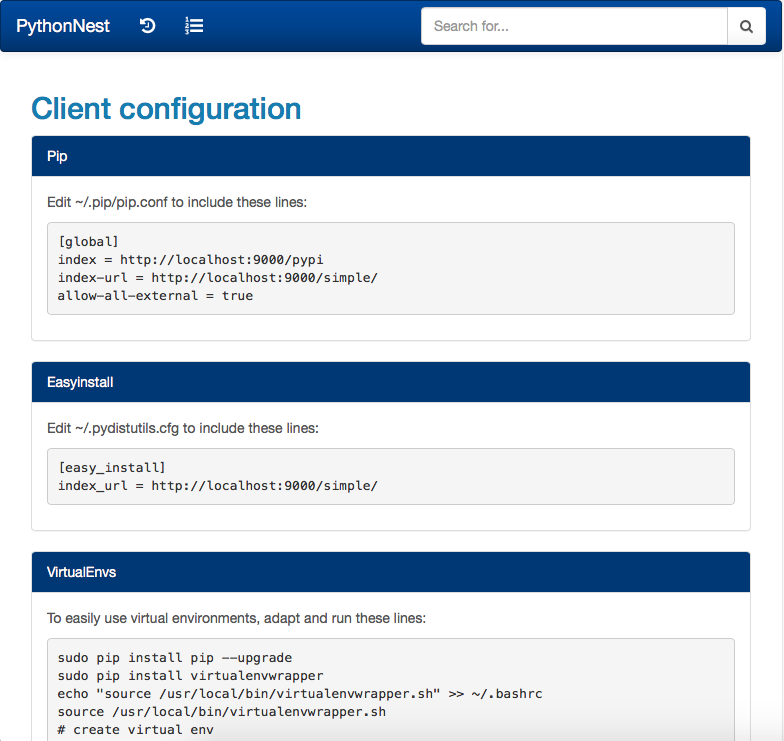
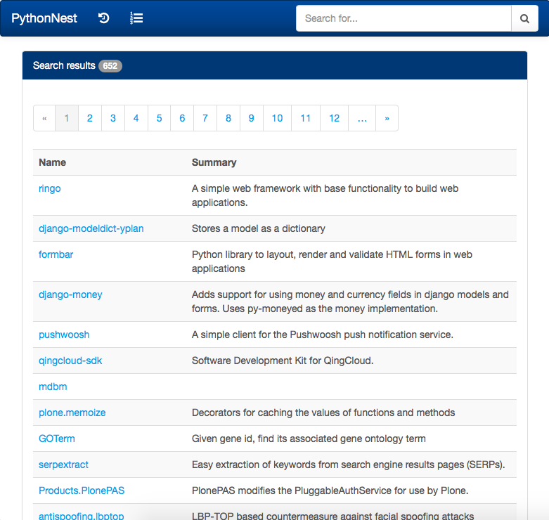
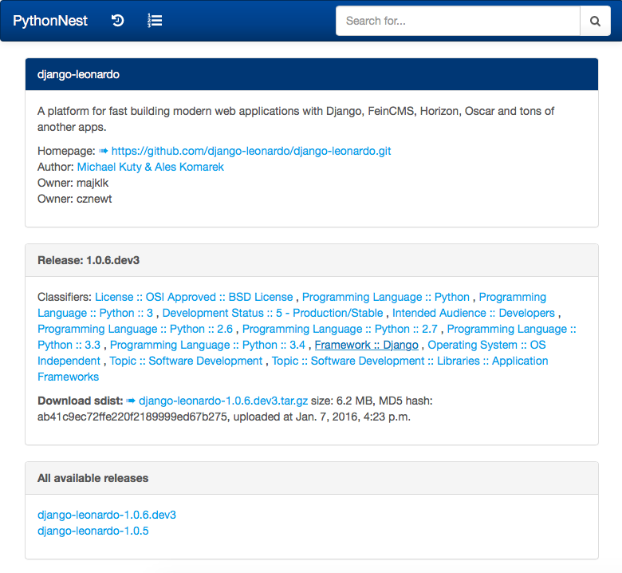

.. PythonNest documentation master file, created by

Welcome to PythonNest's documentation!
======================================

Read-only Pypi mirror for disconnected networks, with advanced export / import functionnalities compared to other Pypi mirrors.
You should run two PythonNest instances:

   * the first one is connected to the internet and regularly fetch updates from the official mirror,
   * the second one is in your disconnected network.

The first instance export its data as plain files. Then these files can be sent to the second instance with a USB disk.

If you are looking for a mirror hosting your own private packages, you should look at `Moneta <http://moneta.readthedocs.org>`_.

:doc:`installation`
    Instruction on how to get the distribution

:doc:`configuration`
    All configuration options

:doc:`debian`
    Packaging PythonNest for Debian or Ubuntu servers

:doc:`operating`
    Operating the mirror: update, import and export operations

Full table of contents
======================

.. toctree::
   :maxdepth: 1

   installation
   configuration
   debian
   operating

Indices and tables
==================

* :ref:`genindex`
* :ref:`modindex`
* :ref:`search`

